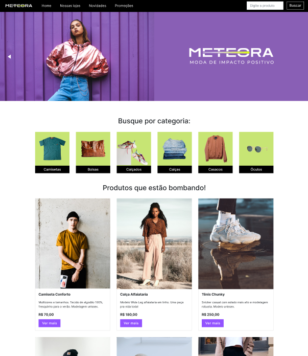

# E-commerce Meteora
[Acesse o site aqui! ✨](https://luhoro.github.io/meteora/)


## Descrição
Projeto realizado para o Challenge Frontend 7ª edição, fornecido pela Alura. Para esse desafio foi necessário atender às demandas da empresa detalhado em tópicos, e o prazo para término do projeto foi de 4 semanas.

[Para rodar o projeto em sua máquina clique aqui](#rodar-localmente)

## Tecnologias utilizadas


## Materiais fornecidos
Para o desenvolvimento do projeto, foi fornecido 3 planos de estudos com os assuntos necessários para nos guiar. Para nos organizarmos e respeitarmos o prazo, foi fornecido também um modelo kanban no aplicativo Trello para cada semana.


| **Planos de estudos** | **Cards Trello** | 
| - | - |
|  [Meteora - Semana 1](https://cursos.alura.com.br/meteora-alura-challenge-semana-1-monicahillman-1684248914638-p592517?_gl=1*1re64n9*_ga*MjA3ODk5MjAyLjE2NzQ1NzM4NjY.*_ga_59FP0KYKSM*MTY4OTYyMTE2OC41MTEuMS4xNjg5NjIyOTExLjAuMC4w*_fplc*ZUZiQThXWGVQJTJGOFI3T3ZZU2lwYjc3R3BrRWFiSTd0YmlTTzclMkJVOEV6SHRqMUlkRUY1cmpWcnVmN2lOUjNzUDJ2VCUyQnlrUGhqSCUyRkdENjhCMmxJSUVPNTFBTnd3eHZBZXh2aTh6VW4zQXlCMWt4enFsbyUyQmw2QkNzdmpyUFJGQSUzRCUzRA..) | [Meteora - Semana 1](https://trello.com/b/8stNxpRc/challenge-front-end-semana-1) |
| [Meteora - Semana 2 ](https://cursos.alura.com.br/meteora-alura-challenge-semana-2-monicahillman-1684248986060-p592519?_gl=1*lb2l87*_ga*MjA3ODk5MjAyLjE2NzQ1NzM4NjY.*_ga_59FP0KYKSM*MTY4OTYyMTE2OC41MTEuMS4xNjg5NjIyOTExLjAuMC4w*_fplc*ZUZiQThXWGVQJTJGOFI3T3ZZU2lwYjc3R3BrRWFiSTd0YmlTTzclMkJVOEV6SHRqMUlkRUY1cmpWcnVmN2lOUjNzUDJ2VCUyQnlrUGhqSCUyRkdENjhCMmxJSUVPNTFBTnd3eHZBZXh2aTh6VW4zQXlCMWt4enFsbyUyQmw2QkNzdmpyUFJGQSUzRCUzRA..) | [Meteora - Semana 2](https://trello.com/b/7RIfsNFO/challenge-front-end-semana-2) |
| [Meteora - Semana 3 e 4](https://cursos.alura.com.br/meteora-alura-challenge-semana-3-e-4-monicahillman-1684249122472-p592524?_gl=1*lb2l87*_ga*MjA3ODk5MjAyLjE2NzQ1NzM4NjY.*_ga_59FP0KYKSM*MTY4OTYyMTE2OC41MTEuMS4xNjg5NjIyOTExLjAuMC4w*_fplc*ZUZiQThXWGVQJTJGOFI3T3ZZU2lwYjc3R3BrRWFiSTd0YmlTTzclMkJVOEV6SHRqMUlkRUY1cmpWcnVmN2lOUjNzUDJ2VCUyQnlrUGhqSCUyRkdENjhCMmxJSUVPNTFBTnd3eHZBZXh2aTh6VW4zQXlCMWt4enFsbyUyQmw2QkNzdmpyUFJGQSUzRCUzRA..) |  [Meteora- Semana 3 e 4](https://trello.com/b/0Lneryvl/challenge-front-end-semanas-3-e-4) |


### Design
[Acesse o figma do Projeto aqui](https://www.figma.com/file/2TLgt8UjsWUViWlmpXu5Fz/Challenge-Front-end-%7C-Loja-Meteora?type=design&node-id=2386-3188&mode=design&t=bpa8eE2IWC8XAD9Q-0)




## História
A Meteora é uma empresa do comércio eletrônico de roupas atemporais, casuais e sem gênero. Ela acredita que a moda é muito mais do que apenas tendências passageiras e oferece peças versáteis que se adaptam a qualquer estilo e ocasião.

A empresa tem por objetivo se tornar referência no mercado, atraindo mais clientes e impulsionando suas vendas, buscando alcançar um novo patamar e consolidando-se como uma empresa mais digital.

Para isso, eles solicitaram nossa ajuda como desenvolvedores para criar um site de um e-commerce, que proporcionem uma experiência de compra incrível para seus clientes, e que atendam aos seguintes requisitos:

- Uma página inicial que contenha um buscador de produtos oferecidos pela empresa;
- Um banner/carrossel que contenha informações sobre a coleção do momento;
- Uma galeria com as categorias dos produtos disponíveis na loja;
- Uma galeria com as informações dos produtos, como: imagem, nome do produto, descrição e link que leva até a página de “Saiba mais sobre o produto”.
- Uma modal que contenha a imagem, o nome, a descrição, o preço, as variações do produto e a opção de adicionar na sacola;
- Uma seção para divulgar as facilidades que a loja proporciona para realizar as compras;
- Uma seção para cadastrar na newsletter e receber novidades;
- Um rodapé com informação do site.


Um detalhe muito importante é que o site precisa ser responsivo, para proporcionar aos clientes facilidade de compra através de dispositivos mobiles.

## Rodar localmente
Clone o repositório com
``` git clone https://github.com/luhoro/meteora.git```

Vá para a pasta do projeto
``` cd meteora  ```

Instale as dependências com
``` npm install  ```

Baixe a extensão [Liver Server (VS Code) aqui](https://marketplace.visualstudio.com/items?itemName=ritwickdey.LiveServer)
e rode apertando em "Go Live" no canto inferior direto.
